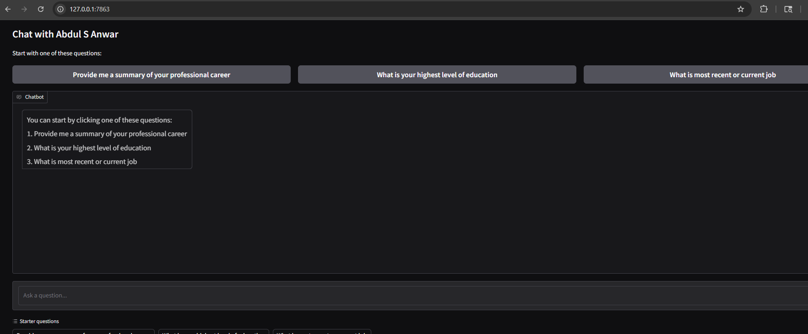

# Personal Career Chatbot

This project is a Gradio-based personal career chatbot for **Abdul S Anwar**. It answers questions about Abdul's professional background, skills, education, and experience using a resume PDF and summary text file as context.



The app also includes lightweight lead capture and notification tools, basic spam protection, session-level user identification, clickable starter questions, and local JSONL logging.

## Features

- **Personal career Q&A**: Answers questions using `me/summary.txt` and `me/abdul-resume.pdf`.
- **OpenAI Responses API**: Uses OpenAI's Responses API for model interaction and tool calling.
- **Function tools**:
  - Records user contact details when an email is provided.
  - Records unknown questions the assistant could not answer.
- **Pushover notifications**: Sends notifications when user details or unknown questions are recorded.
- **Clickable starter questions**: Shows suggested questions at launch so visitors can begin quickly.
- **Session-level user identification**: Tracks users by Gradio session hash.
- **Basic bot spam protection**:
  - Message length limit.
  - Link count limit.
  - Per-session rate limiting.
- **Tool usage gating**:
  - Explicit allowlist of callable tools.
  - Per-session tool usage limit.
  - Basic email validation.
  - Unknown question sanity checks.
- **Local logging**:
  - Conversations.
  - User details.
  - Unknown questions.
  - Blocked requests.
  - Started sessions.

## Tools And Technologies

- **Python**: Main application language.
- **Gradio**: Web-based chatbot UI.
- **OpenAI Python SDK**: Connects to the OpenAI Responses API.
- **OpenAI Responses API**: Handles chat responses and function tool calls.
- **Pushover API**: Sends push notifications for leads and unanswered questions.
- **pypdf**: Extracts text from the resume PDF.
- **python-dotenv**: Loads environment variables from `.env`.
- **requests**: Sends HTTP requests to the Pushover API.
- **JSONL logs**: Stores lightweight local event and conversation logs.

## Project Structure

```text
.
|-- app.py
|-- requirements.txt
|-- README.md
|-- me/
|   |-- abdul-resume.pdf
|   `-- summary.txt
`-- logs/
    |-- conversations.jsonl
    |-- user_details.jsonl
    |-- unknown_questions.jsonl
    |-- blocked_requests.jsonl
    `-- sessions.jsonl
```

The `logs/` directory is created automatically when events are written.

## Setup

1. Create and activate a virtual environment:

```powershell
python -m venv .venv
.\.venv\Scripts\activate
```

2. Install dependencies:

```powershell
pip install -r requirements.txt
```

3. Create a `.env` file:

```env
OPENAI_API_KEY=your_openai_api_key
PUSHOVER_TOKEN=your_pushover_app_token
PUSHOVER_USER=your_pushover_user_key
OPENAI_MODEL=gpt-4o-mini
```

Pushover values are optional. If they are missing, the app will still run and will log events locally instead of sending push notifications.

4. Add profile context files:

```text
me/summary.txt
me/abdul-resume.pdf
```

## Usage

Run the app:

```powershell
python app.py
```

Open the local Gradio URL shown in the terminal.

At launch, users can click one of the starter questions:

- Provide me a summary of your professional career
- What is your highest level of education
- What is most recent or current job

Users can also type custom questions into the chat box.

## Configuration

The following environment variables can be used to tune basic protection:

```env
MAX_MESSAGE_CHARS=2000
RATE_LIMIT_MESSAGES=12
RATE_LIMIT_WINDOW_SECONDS=60
TOOL_LIMIT_PER_SESSION=5
TOOL_LIMIT_WINDOW_SECONDS=3600
MAX_LINKS_PER_MESSAGE=4
```

## Work Completed So Far

- Built the main Gradio chatbot interface.
- Added resume PDF and summary text loading.
- Added OpenAI model interaction.
- Upgraded the chat flow to use the OpenAI Responses API.
- Added tool calling for lead capture and unknown question tracking.
- Added Pushover notifications.
- Replaced dynamic global tool lookup with an explicit tool allowlist.
- Added safer handling for missing credentials and unreadable files.
- Added local JSONL logging.
- Added session-level user identification.
- Added basic bot spam protection.
- Added gatekeeping around tool usage.
- Added clickable starter questions and an initial chatbot prompt.
- Added history sanitization so Gradio UI metadata is not sent to OpenAI.

## Future Work

- **Analytics dashboard**: Show user question types, common topics, unanswered questions, lead volume, and conversation trends.
- **Persistent storage**: Move from local JSONL files to SQLite, PostgreSQL, Supabase, or another durable database.
- **Stronger spam filtering**: Add IP-based rate limits, content heuristics, bot detection, and optional CAPTCHA.
- **Intent detection**: Classify conversations as job inquiry, client inquiry, casual chat, recruiting outreach, technical question, or unknown.
- **Auto follow-up email**: Send a follow-up email when a user provides contact details.
- **Admin review panel**: Review captured leads, unanswered questions, and conversation logs.
- **Improved contact workflow**: Ask for name, email, company, role, and reason for reaching out in a structured way.
- **Deployment hardening**: Add production logging, secrets management, HTTPS hosting, and monitoring.

## Notes

This project is intentionally lightweight. The current protection features are designed to reduce accidental abuse and obvious spam without adding a database, authentication layer, or complex backend architecture.
